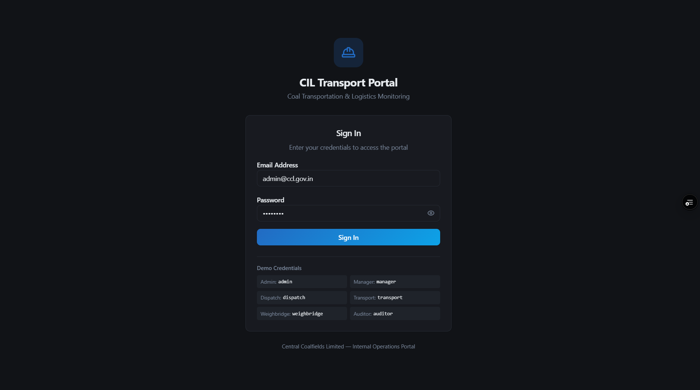
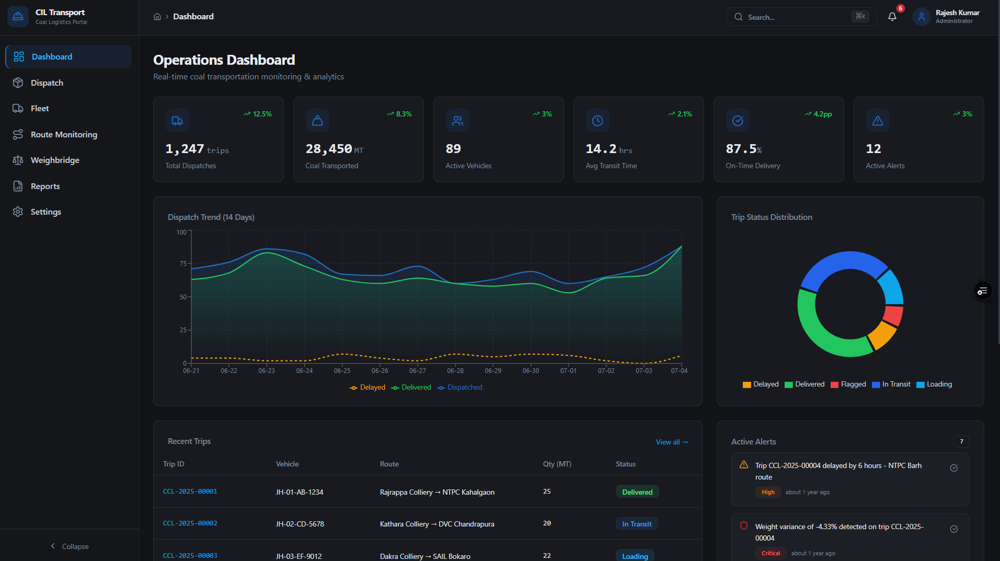
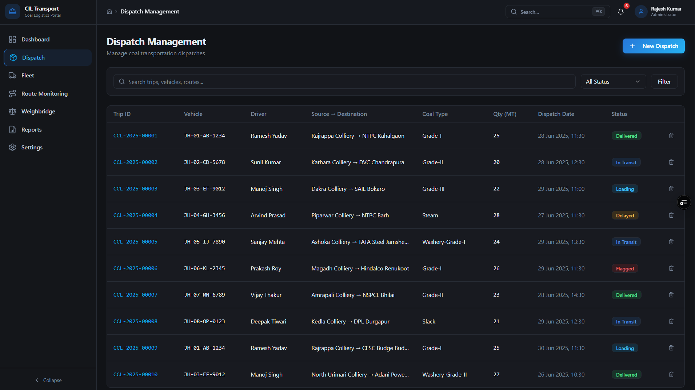
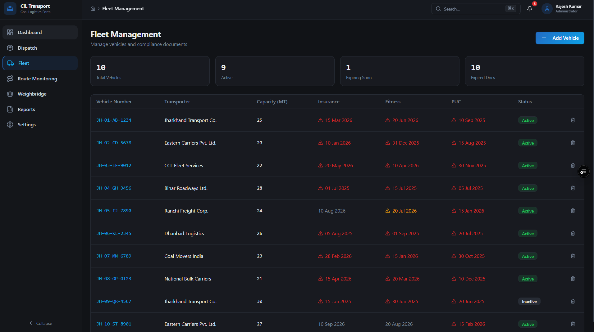
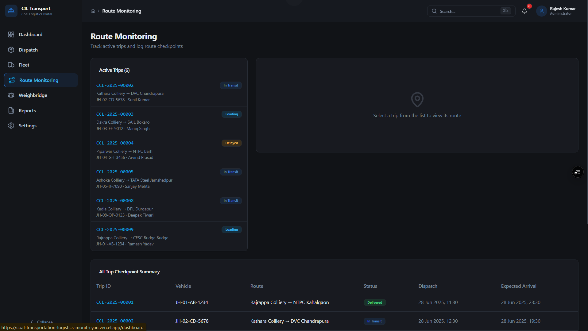
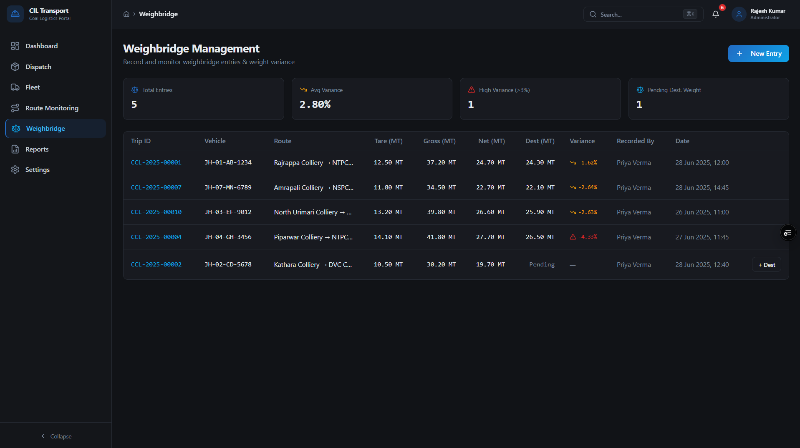
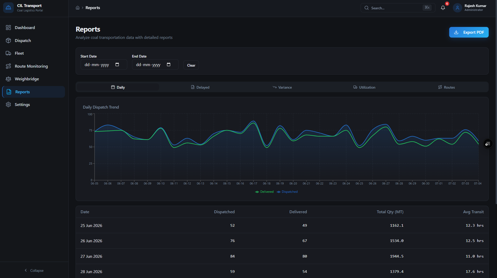

# 🚛 Coal Transportation & Logistics Monitoring Portal

A modern full-stack enterprise web application inspired by Coal India Limited (CIL) transportation workflows. The portal digitizes coal dispatch operations, fleet monitoring, weighbridge management, route tracking, and operational analytics through a secure role-based dashboard.

> Built as a portfolio project to simulate a real-world logistics management system used by dispatch officers, transport managers, weighbridge operators, and administrators.

---

## 🌐 Live Demo

🔗 **Live Application:** https://coal-transportation-logistics-monit-cyan.vercel.app

---

## 📸 Application Preview

The following screenshots showcase the major modules of the **CIL Transport Portal**. The application follows a modern enterprise dashboard design with role-based authentication, transportation management, fleet monitoring, weighbridge operations, and reporting.

---

### 🔐 Login Page



The application starts with a secure **JWT-based login page**.

> **Demo Credentials**
>
> The application is designed as an internal enterprise portal, so public user registration is **not available**. Demo accounts are seeded into the database for testing.
>
> **Email:** `admin@ccl.gov.in`
>
> **Password:** `admin`

Additional seeded users are also available for different operational roles (Dispatch Manager, Transport Officer, Weighbridge Operator, Auditor, etc.).

---

### 📊 Operations Dashboard



The dashboard provides a centralized overview of transportation operations, including:

- Total dispatches
- Coal transported
- Active vehicles
- Transit time
- Delivery performance
- Active alerts
- Dispatch trend analytics
- Trip status distribution
- Recent trips

---

### 🚛 Dispatch Management



Manage and monitor coal transportation dispatches from source to destination.

Features include:

- Trip listing
- Status tracking
- Search & filtering
- Vehicle assignment
- Driver information
- Coal quantity records
- Dispatch lifecycle monitoring

---

### 🚚 Fleet Management



Monitor all registered transportation vehicles and compliance information.

Features include:

- Vehicle inventory
- Transport company details
- Capacity tracking
- Insurance expiry
- Fitness certificate monitoring
- Pollution certificate tracking
- Vehicle status management

---

### 📍 Route Monitoring



Track active transportation routes and monitor trip progress throughout the logistics pipeline.

Features include:

- Active trip tracking
- Route checkpoint summary
- Dispatch timeline
- Expected arrival information
- Route monitoring interface

---

### ⚖️ Weighbridge Management



Manage source and destination weighbridge operations while monitoring coal quantity variance.

Features include:

- Gross weight
- Net weight
- Tare weight
- Destination weight
- Variance calculation
- Pending weighbridge entries
- High variance alerts

---

### 📈 Reports & Analytics



Generate analytical reports for transportation operations.

Available reports include:

- Daily Dispatch Reports
- Delayed Trips
- Quantity Variance Analysis
- Fleet Utilization
- Route Analysis
- PDF Export
- Date Range Filtering

## ✨ Features

### 🔐 Authentication

- Secure JWT Authentication
- Password hashing using bcrypt
- Protected routes
- Persistent login session
- Invalid credential validation
- Role-based authorization

---

### 📊 Dashboard

- Real-time operational KPIs
- Total Dispatches
- Coal Transported
- Active Vehicles
- Average Transit Time
- On-time Delivery Percentage
- Active Alerts
- Dispatch Trend Chart
- Trip Status Distribution

---

### 🚛 Dispatch Management

- View dispatch records
- Search dispatches
- Filter by status
- Create new dispatches
- Dispatch status tracking

---

### 🚚 Fleet Management

- Vehicle management
- Driver assignment
- Fleet monitoring
- Vehicle utilization

---

### 📍 Route Monitoring

- Live trip monitoring
- Route checkpoints
- Delivery progress
- Delay tracking

---

### ⚖️ Weighbridge

- Coal weight recording
- Source & destination entries
- Quantity verification
- Weight variance monitoring

---

### 📈 Reports

Generate operational reports including:

- Daily Reports
- Route Reports
- Delayed Trips
- Vehicle Utilization
- Coal Variance
- Alert Reports

---

### ⚙️ Backend Features

- MongoDB Atlas integration
- Mongoose models
- REST APIs
- JWT Authentication
- Zod validation
- Serverless Functions
- Error handling
- Environment variable configuration

---

## 🛠 Tech Stack

### Frontend

- React 19
- TypeScript
- Vite
- React Router
- Tailwind CSS
- Radix UI
- Recharts
- Axios

### Backend

- Node.js
- Vercel Serverless Functions
- MongoDB Atlas
- Mongoose
- JWT
- bcryptjs
- Zod

### Deployment

- Vercel
- MongoDB Atlas

---

## 📂 Project Structure

```
api/
models/
middleware/
validators/
src/
 ├── components/
 ├── pages/
 ├── routes/
 ├── services/
 ├── hooks/
 ├── context/
 └── lib/
```

---

## 🔑 Demo Credentials

This project currently uses seeded demo accounts.

### Administrator

**Email**

```
admin@cil.in
```

**Password**

```
admin123
```

---

### Dispatch Manager

**Email**

```
dispatch@cil.in
```

**Password**

```
admin123
```

> **Note**
>
> User registration is intentionally disabled.
> This application is designed as an enterprise internal portal where user accounts are created and managed by system administrators rather than through public sign-up.

---

## 🚀 Running Locally

### Clone the repository

```bash
git clone https://github.com/krishitdas/coal-transportation-logistics-monitoring-portal.git
```

---

### Navigate into the project

```bash
cd coal-transportation-logistics-monitoring-portal
```

---

### Install dependencies

```bash
npm install
```

---

### Configure Environment Variables

Create a `.env` file in the project root.

```env
MONGODB_URI=your_mongodb_connection_string

JWT_SECRET=your_secret_key

NODE_ENV=development
```

---

### Seed the Database

```bash
npm run seed
```

This creates the demo users required for authentication.

---

### Start Development Server

```bash
npm run dev
```

---

### Production Build

```bash
npm run build
```

---

## 🔒 Authentication Flow

```
User Login
      │
      ▼
JWT Generated
      │
      ▼
Protected API Routes
      │
      ▼
MongoDB Validation
      │
      ▼
Dashboard Access
```

---

## 🧩 API Overview

The backend is powered by consolidated Vercel Serverless Functions handling:

- Authentication
- Dashboard
- Users
- Trips
- Vehicles
- Alerts
- Reports
- Checkpoints
- Weighbridge

---

## 💡 Highlights

- Enterprise-inspired UI
- Dark professional dashboard
- Responsive design
- Authentication & Authorization
- MongoDB Atlas integration
- Secure password hashing
- Role-based access
- Production deployment on Vercel
- Serverless backend architecture

---

## 📌 Future Improvements

- Real-time GPS vehicle tracking
- WebSocket live updates
- Notification system
- Multi-factor authentication
- Audit logs
- PDF report generation
- Advanced analytics
- Email notifications
- Admin user management portal

---

## 👨‍💻 Author

**Krishit Das**

GitHub

https://github.com/krishitdas

LinkedIn

*[(LinkedIn)](https://www.linkedin.com/in/krishit1/)*

---

## 📄 License

This project is intended for educational and portfolio purposes.
