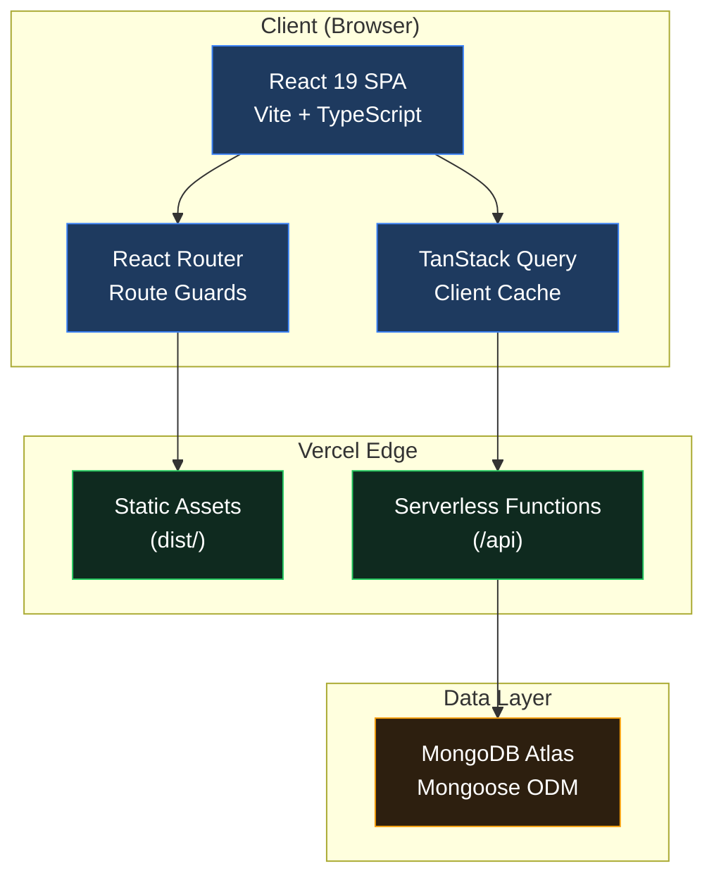
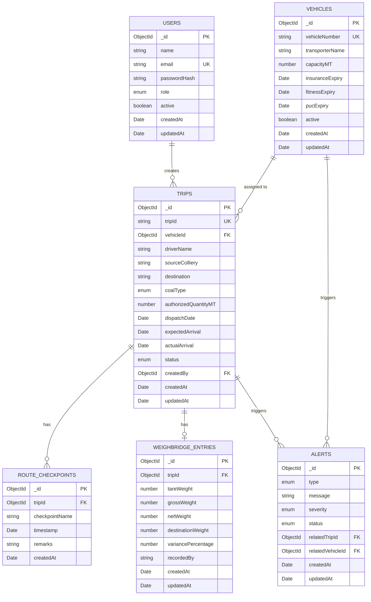
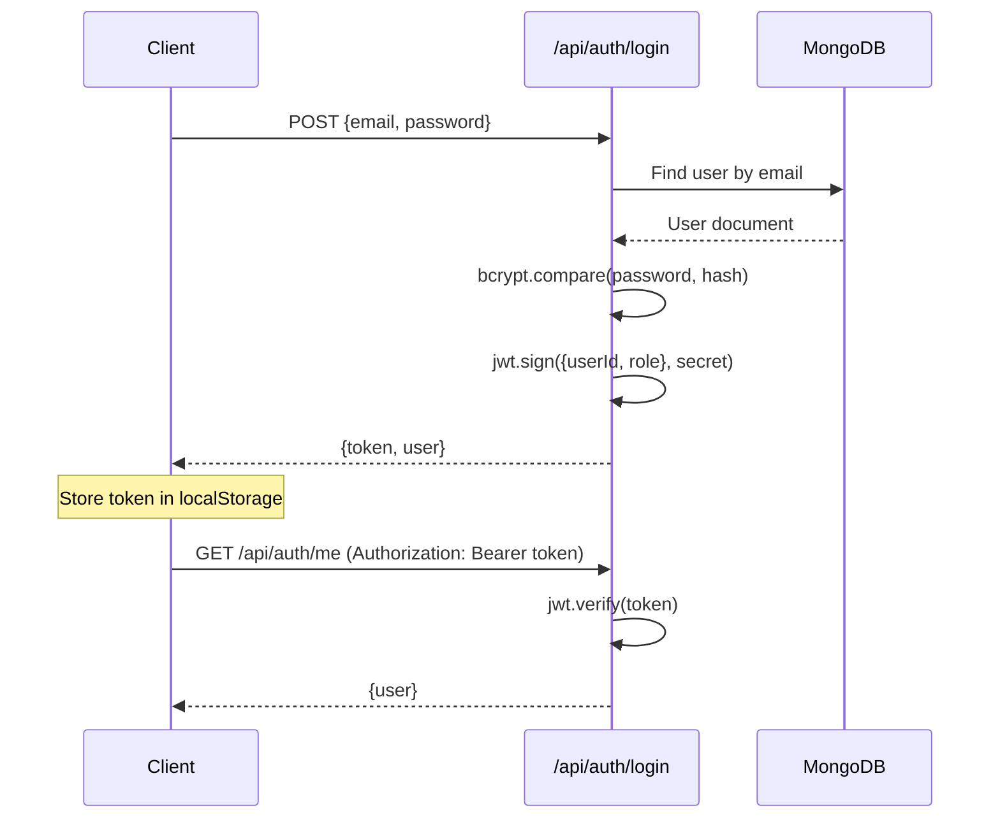

# Coal Transportation & Logistics Monitoring Portal — Implementation Plan

## 1. Project Overview

A production-quality enterprise web application to digitize and centralize coal transportation operations for Coal India subsidiaries. The portal tracks the full coal movement lifecycle from colliery through weighbridges and checkpoints to final delivery.

---

## 2. System Architecture



### Architecture Decisions

| Decision | Choice | Rationale |
|---|---|---|
| Frontend Framework | React 19 + Vite | Latest React with fast HMR, optimized builds |
| Styling | Tailwind CSS v4 + Shadcn UI | Enterprise component library, consistent design tokens |
| State Management | TanStack Query + React Context | Server state caching, minimal client state |
| API Layer | Vercel Serverless Functions | Zero-config deployment, auto-scaling, no server management |
| Database | MongoDB Atlas + Mongoose | Flexible schema for logistics data, free tier available |
| Auth | JWT + bcryptjs | Stateless authentication ideal for serverless |
| Validation | Zod | Type-safe runtime validation, shared schemas |
| Charts | Recharts | React-native charting, composable, lightweight |

---

## 3. Database Design



### Indexes Strategy

| Collection | Index | Type | Purpose |
|---|---|---|---|
| Users | `email` | Unique | Login lookup |
| Vehicles | `vehicleNumber` | Unique | Vehicle lookup |
| Trips | `tripId` | Unique | Trip identification |
| Trips | `status` | Standard | Dashboard filtering |
| Trips | `dispatchDate` | Standard | Date-range queries |
| Trips | `vehicleId` | Standard | Vehicle utilization |
| RouteCheckpoints | `tripId` | Standard | Trip checkpoint lookup |
| RouteCheckpoints | `timestamp` | Standard | Timeline queries |
| WeighbridgeEntries | `tripId` | Unique | Trip weight lookup |
| Alerts | `status` | Standard | Active alert filtering |
| Alerts | `severity` | Standard | Priority sorting |

### Enumerations

| Field | Values |
|---|---|
| User Role | `Admin`, `AreaManager`, `DispatchOfficer`, `TransportOfficer`, `WeighbridgeOperator`, `Auditor` |
| Trip Status | `Loading`, `InTransit`, `Delivered`, `Delayed`, `Flagged` |
| Coal Type | `Grade-I`, `Grade-II`, `Grade-III`, `Washery-Grade-I`, `Washery-Grade-II`, `Slack`, `Steam` |
| Alert Type | `Delay`, `WeightVariance`, `VehicleExpiry`, `RouteDeviation` |
| Alert Severity | `Low`, `Medium`, `High`, `Critical` |
| Alert Status | `Active`, `Acknowledged`, `Resolved` |

---

## 4. Complete File Structure

```
d:\DSA\CIL Project\
│
├── api/                              # Vercel Serverless Functions
│   ├── auth/
│   │   ├── login.ts                  # POST /api/auth/login
│   │   ├── me.ts                     # GET /api/auth/me
│   │   └── logout.ts                 # POST /api/auth/logout
│   ├── dashboard/
│   │   ├── kpis.ts                   # GET /api/dashboard/kpis
│   │   ├── trends.ts                 # GET /api/dashboard/trends
│   │   ├── alerts.ts                 # GET /api/dashboard/alerts
│   │   └── live-trips.ts             # GET /api/dashboard/live-trips
│   ├── trips/
│   │   ├── index.ts                  # GET / POST /api/trips
│   │   └── [id].ts                   # GET / PUT / DELETE /api/trips/:id
│   ├── vehicles/
│   │   ├── index.ts                  # GET / POST /api/vehicles
│   │   └── [id].ts                   # GET / PUT / DELETE /api/vehicles/:id
│   ├── checkpoints/
│   │   ├── index.ts                  # POST /api/checkpoints
│   │   └── [tripId].ts              # GET /api/checkpoints/:tripId
│   ├── weighbridge/
│   │   ├── index.ts                  # GET / POST /api/weighbridge
│   │   └── [id].ts                   # PUT /api/weighbridge/:id
│   ├── reports/
│   │   ├── daily.ts                  # GET /api/reports/daily
│   │   ├── delayed.ts               # GET /api/reports/delayed
│   │   ├── variance.ts              # GET /api/reports/variance
│   │   ├── utilization.ts           # GET /api/reports/utilization
│   │   └── routes.ts                # GET /api/reports/routes
│   ├── alerts/
│   │   ├── index.ts                  # GET /api/alerts
│   │   └── [id]/
│   │       └── read.ts              # PUT /api/alerts/:id/read
│   └── users/
│       ├── index.ts                  # GET / POST /api/users
│       └── [id].ts                   # GET / PUT / DELETE /api/users/:id
│
├── models/                           # Mongoose Models
│   ├── User.ts
│   ├── Vehicle.ts
│   ├── Trip.ts
│   ├── RouteCheckpoint.ts
│   ├── WeighbridgeEntry.ts
│   └── Alert.ts
│
├── middleware/                        # API Middleware
│   ├── auth.ts                       # JWT verification
│   ├── roles.ts                      # Role-based access
│   └── validate.ts                   # Zod validation wrapper
│
├── validators/                        # Zod Schemas
│   ├── auth.ts
│   ├── trip.ts
│   ├── vehicle.ts
│   ├── checkpoint.ts
│   ├── weighbridge.ts
│   ├── alert.ts
│   └── user.ts
│
├── lib/                              # Shared Utilities (Server)
│   └── mongodb.ts                    # Connection singleton
│
├── scripts/                          # CLI Scripts
│   └── seed.ts                       # Database seeding
│
├── src/                              # Frontend Source
│   ├── components/
│   │   ├── ui/                       # Shadcn UI components (auto-generated)
│   │   ├── layout/
│   │   │   ├── AppLayout.tsx         # Main layout wrapper
│   │   │   ├── Sidebar.tsx           # Navigation sidebar
│   │   │   ├── Header.tsx            # Top header bar
│   │   │   ├── CommandSearch.tsx     # Command palette (Cmd+K)
│   │   │   └── BreadcrumbNav.tsx     # Breadcrumb navigation
│   │   ├── dashboard/
│   │   │   ├── KPICard.tsx           # Interactive KPI card
│   │   │   ├── KPIGrid.tsx           # KPI cards grid
│   │   │   ├── DispatchTrendChart.tsx # Daily dispatch trend
│   │   │   ├── StatusDistChart.tsx   # Trip status pie/donut
│   │   │   ├── RouteUtilChart.tsx    # Route utilization bar
│   │   │   ├── LiveTripsTable.tsx    # Real-time trips table
│   │   │   └── AlertsPanel.tsx       # Alerts sidebar panel
│   │   ├── dispatch/
│   │   │   ├── DispatchTable.tsx     # Dispatch data table
│   │   │   ├── DispatchForm.tsx      # Create/Edit dispatch form
│   │   │   ├── DispatchFilters.tsx   # Search/filter controls
│   │   │   └── DispatchDetail.tsx    # Single dispatch detail
│   │   ├── fleet/
│   │   │   ├── VehicleTable.tsx      # Fleet data table
│   │   │   ├── VehicleForm.tsx       # Add/Edit vehicle form
│   │   │   ├── VehicleCard.tsx       # Vehicle summary card
│   │   │   └── ExpiryAlerts.tsx      # Expiry alert badges
│   │   ├── weighbridge/
│   │   │   ├── WeighbridgeTable.tsx  # Weighbridge records
│   │   │   ├── WeighbridgeForm.tsx   # Record entry form
│   │   │   └── VarianceIndicator.tsx # Variance display
│   │   ├── monitoring/
│   │   │   ├── RouteTimeline.tsx     # Checkpoint timeline
│   │   │   ├── CheckpointForm.tsx    # Log checkpoint form
│   │   │   └── DelayIndicator.tsx    # Delay status badge
│   │   └── reports/
│   │       ├── ReportFilters.tsx     # Date/vehicle/route filters
│   │       ├── ReportTable.tsx       # Generic report table
│   │       ├── ReportChart.tsx       # Report visualization
│   │       └── ExportButton.tsx      # PDF export trigger
│   │
│   ├── pages/
│   │   ├── Login/
│   │   │   └── LoginPage.tsx
│   │   ├── Dashboard/
│   │   │   └── DashboardPage.tsx
│   │   ├── Dispatch/
│   │   │   ├── DispatchListPage.tsx
│   │   │   └── DispatchDetailPage.tsx
│   │   ├── Fleet/
│   │   │   └── FleetPage.tsx
│   │   ├── RouteMonitoring/
│   │   │   └── RouteMonitoringPage.tsx
│   │   ├── Weighbridge/
│   │   │   └── WeighbridgePage.tsx
│   │   ├── Reports/
│   │   │   └── ReportsPage.tsx
│   │   └── Settings/
│   │       ├── SettingsPage.tsx
│   │       └── UserManagement.tsx
│   │
│   ├── hooks/
│   │   ├── useAuth.ts
│   │   ├── useTrips.ts
│   │   ├── useVehicles.ts
│   │   ├── useCheckpoints.ts
│   │   ├── useWeighbridge.ts
│   │   ├── useDashboard.ts
│   │   ├── useReports.ts
│   │   ├── useAlerts.ts
│   │   └── useUsers.ts
│   │
│   ├── services/
│   │   ├── api.ts                    # Axios/fetch base config
│   │   ├── auth.service.ts
│   │   ├── trip.service.ts
│   │   ├── vehicle.service.ts
│   │   ├── checkpoint.service.ts
│   │   ├── weighbridge.service.ts
│   │   ├── dashboard.service.ts
│   │   ├── report.service.ts
│   │   ├── alert.service.ts
│   │   └── user.service.ts
│   │
│   ├── routes/
│   │   ├── index.tsx                 # Route definitions
│   │   └── ProtectedRoute.tsx        # Auth guard wrapper
│   │
│   ├── context/
│   │   ├── AuthContext.tsx           # Auth state provider
│   │   └── ThemeContext.tsx          # Theme provider
│   │
│   ├── types/
│   │   ├── auth.types.ts
│   │   ├── trip.types.ts
│   │   ├── vehicle.types.ts
│   │   ├── checkpoint.types.ts
│   │   ├── weighbridge.types.ts
│   │   ├── dashboard.types.ts
│   │   ├── report.types.ts
│   │   ├── alert.types.ts
│   │   └── user.types.ts
│   │
│   ├── utils/
│   │   ├── formatters.ts            # Date, number, weight formatters
│   │   ├── constants.ts             # App constants, enums
│   │   └── cn.ts                    # className utility
│   │
│   ├── lib/
│   │   └── utils.ts                 # Shadcn utility (auto-generated)
│   │
│   ├── assets/
│   │   └── logo.svg
│   │
│   ├── App.tsx
│   ├── main.tsx
│   └── index.css                    # Tailwind + Design tokens
│
├── public/
│   └── favicon.ico
│
├── .env.example
├── .gitignore
├── index.html
├── package.json
├── tsconfig.json
├── tsconfig.app.json
├── tsconfig.node.json
├── vite.config.ts
├── vercel.json
├── components.json                   # Shadcn config
└── README.md
```

---

## 5. UI Design System

### Color Tokens (Dark Industrial Theme)

| Token | Value | Usage |
|---|---|---|
| `--background` | `222 15% 8%` (HSL) | Page background — deep slate |
| `--foreground` | `210 20% 92%` | Primary text |
| `--card` | `222 15% 11%` | Card surfaces |
| `--card-foreground` | `210 20% 92%` | Card text |
| `--primary` | `213 70% 45%` | Coal Blue — primary actions |
| `--primary-foreground` | `0 0% 100%` | Text on primary |
| `--secondary` | `217 15% 18%` | Secondary surfaces |
| `--accent` | `199 89% 48%` | Electric Blue — highlights |
| `--muted` | `217 15% 15%` | Muted backgrounds |
| `--muted-foreground` | `215 15% 55%` | Subdued text |
| `--destructive` | `0 72% 51%` | Error/delete states |
| `--border` | `217 15% 18%` | Borders |
| `--ring` | `213 70% 45%` | Focus rings |
| `--success` | `142 70% 45%` | Success states |
| `--warning` | `38 92% 50%` | Warning states |

### Typography

- **Primary Font**: Inter (Google Fonts)
- **Monospace**: JetBrains Mono (for trip IDs, weights, codes)
- **Scale**: 12px / 14px / 16px / 20px / 24px / 30px / 36px

### Component Patterns

| Pattern | Implementation |
|---|---|
| KPI Cards | Shadcn Card + animated counter + trend indicator |
| Data Tables | Shadcn Table + sortable headers + pagination + row hover |
| Forms | Shadcn Form + Zod resolver + field validation |
| Dialogs | Shadcn Dialog/Sheet for create/edit operations |
| Navigation | Collapsible sidebar with icon + label, dock-hover effect |
| Loading | Skeleton shimmer placeholders |
| Toasts | Shadcn Toast for action feedback |
| Search | Command palette (Cmd+K) with Shadcn Command |
| Charts | Recharts with custom dark theme colors |
| Status Badges | Color-coded Shadcn Badge per trip status |

### Interaction Design

- Sidebar: Smooth expand/collapse with icon-only mode
- KPI Cards: Subtle scale on hover, animated number counting
- Tables: Row highlight on hover, clickable rows for detail navigation
- Buttons: Aurora-style gradient on primary CTAs
- Charts: Tooltip on hover, smooth data transitions
- Page transitions: Fade-in on route change
- Loading: Skeleton shimmer that matches card/table layout

---

## 6. API Design & Security

### Authentication Flow



### Role-Based Access Matrix

| Endpoint | Admin | Area Mgr | Dispatch | Transport | Weighbridge | Auditor |
|---|:---:|:---:|:---:|:---:|:---:|:---:|
| Dashboard | ✅ | ✅ | ✅ | ✅ | ✅ | ✅ |
| Create Trip | ✅ | ✅ | ✅ | ❌ | ❌ | ❌ |
| Edit Trip | ✅ | ✅ | ✅ | ❌ | ❌ | ❌ |
| Delete Trip | ✅ | ❌ | ❌ | ❌ | ❌ | ❌ |
| Manage Fleet | ✅ | ✅ | ❌ | ✅ | ❌ | ❌ |
| Weighbridge Entry | ✅ | ❌ | ❌ | ❌ | ✅ | ❌ |
| View Reports | ✅ | ✅ | ✅ | ✅ | ✅ | ✅ |
| Manage Users | ✅ | ❌ | ❌ | ❌ | ❌ | ❌ |
| Route Monitoring | ✅ | ✅ | ✅ | ✅ | ❌ | ✅ |

### Security Measures

- All passwords hashed with bcryptjs (12 salt rounds)
- JWT tokens with 24h expiry
- Zod validation on every API endpoint (server-side)
- Role middleware checks on protected routes
- Generic error messages for auth failures ("Invalid credentials")
- No stack traces in production responses
- Environment variables for all secrets
- CORS headers configured in Vercel

---

## 7. Implementation Roadmap

### Phase 0: Project Scaffolding (~15 min)
1. Initialize Vite + React 19 + TypeScript project
2. Install and configure Tailwind CSS v4
3. Configure path aliases (`@/`)
4. Initialize Shadcn UI
5. Install all Shadcn components needed
6. Install all dependencies (Recharts, TanStack Query, React Router, Zod, Lucide)
7. Create `vercel.json`, `.env.example`, `.gitignore`
8. Set up design tokens in `index.css`

### Phase 1: Backend Foundation (~45 min)
1. Create `lib/mongodb.ts` connection singleton
2. Create all 6 Mongoose models with indexes
3. Create auth middleware (`middleware/auth.ts`)
4. Create role middleware (`middleware/roles.ts`)
5. Create Zod validation middleware
6. Create all Zod validator schemas
7. Create `scripts/seed.ts` with realistic Coal India data

### Phase 2: Authentication Module (~30 min)
1. Build auth API endpoints (`/api/auth/*`)
2. Create `AuthContext` with JWT persistence
3. Create `ProtectedRoute` component
4. Build `LoginPage` with enterprise styling
5. Create `useAuth` hook

### Phase 3: Layout & Navigation (~30 min)
1. Build `AppLayout` with sidebar + header
2. Build collapsible `Sidebar` with navigation links and role-based menu filtering
3. Build `Header` with user menu, notifications bell, breadcrumbs
4. Build `CommandSearch` (Cmd+K palette)
5. Configure React Router with lazy loading

### Phase 4: Dashboard Module (~45 min)
1. Build dashboard API endpoints
2. Build `KPICard` and `KPIGrid`
3. Build `DispatchTrendChart` (Recharts area chart)
4. Build `StatusDistChart` (Recharts donut)
5. Build `RouteUtilChart` (Recharts bar)
6. Build `LiveTripsTable`
7. Build `AlertsPanel`
8. Assemble `DashboardPage`

### Phase 5: Dispatch Management (~40 min)
1. Build trip API endpoints (CRUD)
2. Build `DispatchTable` with sorting/filtering/pagination
3. Build `DispatchForm` (create/edit with Zod validation)
4. Build `DispatchFilters` (search, status, date range)
5. Build `DispatchDetail` view
6. Assemble pages

### Phase 6: Fleet Management (~30 min)
1. Build vehicle API endpoints
2. Build `VehicleTable`
3. Build `VehicleForm`
4. Build `ExpiryAlerts` badges
5. Assemble `FleetPage`

### Phase 7: Route Monitoring (~30 min)
1. Build checkpoint API endpoints
2. Build `RouteTimeline` visualization
3. Build `CheckpointForm`
4. Build `DelayIndicator`
5. Assemble `RouteMonitoringPage`

### Phase 8: Weighbridge Management (~25 min)
1. Build weighbridge API endpoints
2. Build `WeighbridgeTable`
3. Build `WeighbridgeForm` with auto-calculation
4. Build `VarianceIndicator`
5. Assemble `WeighbridgePage`

### Phase 9: Reports Module (~30 min)
1. Build report API endpoints
2. Build `ReportFilters`
3. Build `ReportTable` and `ReportChart`
4. Build `ExportButton` (client-side PDF via jsPDF)
5. Assemble `ReportsPage` with tabs for each report type

### Phase 10: Settings & User Management (~20 min)
1. Build user API endpoints (Admin only)
2. Build user management table
3. Build user create/edit forms
4. Assemble `SettingsPage`

### Phase 11: Polish & Integration (~20 min)
1. Add loading skeletons across all pages
2. Add toast notifications for all CRUD operations
3. Verify responsive design on mobile/tablet
4. Add page transition animations
5. Generate README.md
6. Final review

---

## 8. Deployment Strategy

### Vercel Configuration

```json
{
  "rewrites": [
    { "source": "/api/:path*", "destination": "/api/:path*" },
    { "source": "/(.*)", "destination": "/index.html" }
  ]
}
```

### Environment Variables (Vercel Dashboard)

| Variable | Description |
|---|---|
| `MONGODB_URI` | MongoDB Atlas connection string |
| `JWT_SECRET` | JWT signing secret (min 32 chars) |
| `NODE_ENV` | `production` |

### Deployment Flow

1. Push to GitHub repository
2. Connect repository to Vercel
3. Configure environment variables in Vercel dashboard
4. Vercel auto-detects Vite → builds `dist/` for static
5. Vercel auto-detects `/api` → deploys as serverless functions
6. Run seed script against production DB once

---

## 9. Verification Plan

### Build Verification
- `npm run build` must complete without errors
- All TypeScript types must compile cleanly

### Functional Verification
- Login flow with valid/invalid credentials
- Dashboard loads with seeded data showing real analytics
- CRUD operations on Trips, Vehicles, Weighbridge entries
- Role-based menu visibility
- Report generation with filters
- Responsive layout at 320px, 768px, 1024px, 1440px

### Manual Verification
- Visual polish matches enterprise industrial theme
- All interactions (hover, transitions, skeletons) are smooth
- No console errors in production build

---

## User Review Required

> [!IMPORTANT]
> **Technology Confirmation**: The plan uses **Tailwind CSS v4** (with `@tailwindcss/vite` plugin) and **Shadcn UI** as explicitly requested. Shadcn will be initialized with the "New York" style variant for a more refined enterprise look.

> [!IMPORTANT]
> **API Routes Structure**: Vercel Serverless Functions will be plain TypeScript files in `/api` using `export default function handler(req, res)` pattern. Each file maps to an endpoint. For nested routes like `/api/trips/:id`, we use `[id].ts` file naming convention.

> [!IMPORTANT]
> **PDF Export**: Reports will use client-side PDF generation with `jsPDF` + `jspdf-autotable` (no external paid API). This keeps reports functional without any third-party service.

> [!WARNING]
> **MongoDB Atlas**: You must have a MongoDB Atlas account and cluster ready. The seed script and API routes require a valid `MONGODB_URI` connection string. The free M0 tier is sufficient for development.

## Open Questions

> [!IMPORTANT]
> **Shadcn Style**: Should I use the **"New York"** style (more refined, enterprise-appropriate) or **"Default"** style? I recommend New York for this project.

> [!NOTE]
> **Local Development**: For local API testing, I'll configure Vite's dev server proxy to forward `/api` requests. For full serverless function testing locally, you can optionally use `vercel dev` via the Vercel CLI.
